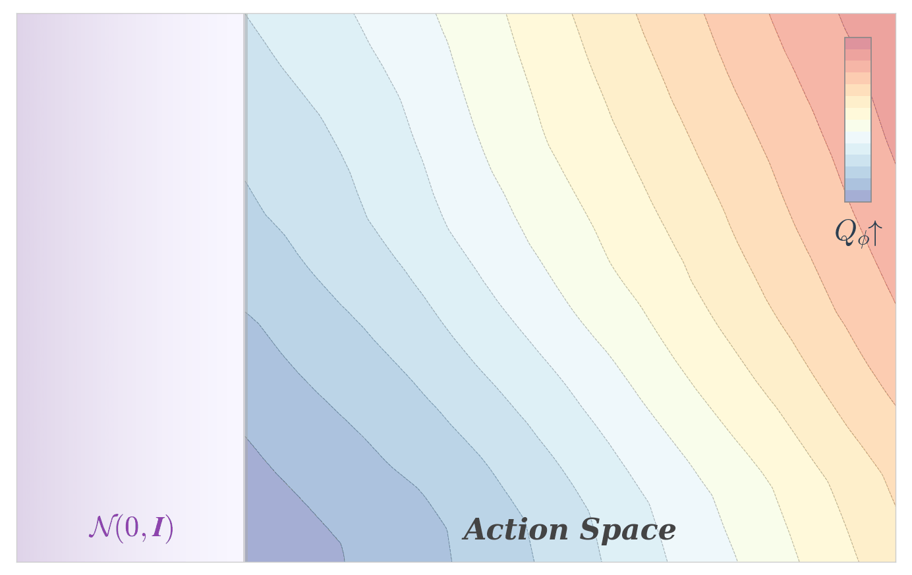

# Aligning Flow Map Policies with Optimal Q-Guidance

<p align="center">
  
</p>

<p align="center">
  <a href="https://arxiv.org/abs/2605.12416"></a>
  <a href="https://huggingface.co/christoszi/flow-map-policies"></a>
  <a href="https://christoszi.github.io/fmq"></a>
</p>

This repository contains the official code for **"Aligning Flow Map Policies with Optimal Q-Guidance"** by Christos Ziakas, Alessandra Russo, and Avishek Joey Bose.

We introduce flow map policies, a novel class of generative policies designed for fast action generation by learning to take arbitrary-size jumps—including one-step jumps—across the generative dynamics of existing flow-based policies. We instantiate flow map policies for offline-to-online reinforcement learning (RL) and formulate online adaptation as a trust-region optimization problem that improves the critic's Q-value while remaining close to the offline policy. We theoretically derive **Flow Map Q-Guidance (FMQ)**, a principled closed-form learning target that is optimal for adapting offline flow map policies under a critic-guided trust-region constraint. We further introduce **Q-Guided Beam Search (QGBS)**, a stochastic flow-map sampler that combines renoising with beam search to enable iterative inference-time refinement.

## Installation

```bash
conda create -n fmq python=3.11 -y
conda activate fmq
pip install -r requirements.txt
```

**Prerequisites:**
- NVIDIA GPU with CUDA 12 support
- MuJoCo (installed automatically via `mujoco` package)

**Environment data:**
- OGBench datasets are downloaded automatically on first run via the `ogbench` package.
- RoboMimic datasets must be downloaded separately; see https://robomimic.github.io/docs/datasets/overview.html

## Usage

**Train FMQ** (1M offline pre-training + 1M online fine-tuning):

```bash
python main.py --config configs/config.yaml \
  --env_name=cube-triple-play-singletask-task4-v0 --seed=0
```

**Evaluate a pretrained checkpoint with Best-of-N:**

```bash
python main.py --config configs/config.yaml \
  --eval_only --fmq_online \
  --restore_path=checkpoints/ctrp4/params_online_sd000.pkl \
  --env_name=cube-triple-play-singletask-task4-v0 --seed=0
```

**Evaluate a pretrained checkpoint with QGBS:**

```bash
python main.py --config configs/qgbs_eval.yaml \
  --eval_only --fmq_online \
  --restore_path=checkpoints/ctrp4/params_online_sd000.pkl \
  --env_name=cube-triple-play-singletask-task4-v0 --seed=0
```

## Pretrained Checkpoints

Pretrained FMQ checkpoints (5 seeds each) are available on [Hugging Face](https://huggingface.co/christoszi/flow-map-policies):

```bash
pip install huggingface_hub
python -c "from huggingface_hub import snapshot_download; snapshot_download('christoszi/flow-map-policies', local_dir='.')"
```

| Folder | Environment |
|--------|-------------|
| `ctrp4/` | `cube-triple-play-singletask-task4-v0` |
| `ctrp3/` | `cube-triple-play-singletask-task3-v0` |
| `cdp4/` | `cube-double-play-singletask-task4-v0` |
| `cdp3/` | `cube-double-play-singletask-task3-v0` |
| `sc4/` | `scene-play-singletask-task4-v0` |
| `sc5/` | `scene-play-singletask-task5-v0` |
| `ag4/` | `antmaze-giant-navigate-singletask-task4-v0` |
| `ag5/` | `antmaze-giant-navigate-singletask-task5-v0` |
| `hm3/` | `humanoidmaze-medium-navigate-singletask-task3-v0` |
| `hm4/` | `humanoidmaze-medium-navigate-singletask-task4-v0` |
| `can/` | `can-mh-low_dim` |
| `square/` | `square-mh-low_dim` |

Each folder contains `params_online_sd000.pkl` through `params_online_sd004.pkl`.

## Environments

| Environment | Benchmark | Reward |
|-------------|-----------|--------|
| `can-mh-low_dim` | RoboMimic | Dense |
| `square-mh-low_dim` | RoboMimic | Dense |
| `cube-double-play-singletask-task{3,4}-v0` | OGBench | Dense |
| `cube-triple-play-singletask-task{3,4}-v0` | OGBench | Dense |
| `scene-play-singletask-task{4,5}-v0` | OGBench | Sparse |
| `humanoidmaze-medium-navigate-singletask-task{3,4}-v0` | OGBench | Sparse |
| `antmaze-giant-navigate-singletask-task{4,5}-v0` | OGBench | Sparse |

## Structure

```
├── main.py                 # Training entry point (offline → online)
├── evaluation.py           # Episodic rollout evaluation
├── configs/                # YAML configuration files
├── checkpoints/            # Pretrained model weights (5 seeds × 12 envs)
├── agents/
│   ├── flow_map_policy.py  # Flow map policy (offline pre-training, §3.2)
│   ├── fmq.py              # FMQ online fine-tuning (§3.3, Theorem 3.2)
│   ├── qgbs.py             # Q-Guided Beam Search (§3.4, Algorithm 2)
│   └── flow_utils.py       # Shared sampling utilities
├── utils/                  # Networks, datasets, encoders, checkpointing
└── envs/                   # Environment loading (OGBench, RoboMimic, D4RL)
```

## Citation

```bibtex
@article{ziakas2026fmq,
  title={Aligning Flow Map Policies with Optimal Q-Guidance},
  author={Ziakas, Christos and Russo, Alessandra and Bose, Avishek Joey},
  journal={arXiv preprint arXiv:2605.12416},
  year={2026},
}
```

## Acknowledgments

This codebase is built on top of [QC](https://github.com/ColinQiyangLi/qc) (Li et al., 2025) and [FQL](https://github.com/seohongpark/FQL) (Park, Li & Levine, 2024). The [Meta Flow Maps](https://github.com/adh1s/mfm) implementation (Potaptchik et al., 2026) was a useful reference for flow maps.
